# ATFM — Additional Things For Mac

맥을 쓰면서 "이거 하나 더 있었으면…" 싶었던 기능들을 메뉴 막대 앱 하나에 모아가는 프로젝트입니다.
클립보드 기록으로 시작해서 체크리스트 · 미니 메모 · 시스템/네트워크 모니터 · 빠른 동작 · 빠른 툴(화면 OCR·스포이드) ·
쇼츠 자동 스크롤 · 파일 변환/다운로드 · 미니 플레이어 · 간편 AI까지, 탭 하나씩 늘려가고 있습니다.

## 스크린샷

<table>
  <tr>
    <td align="center">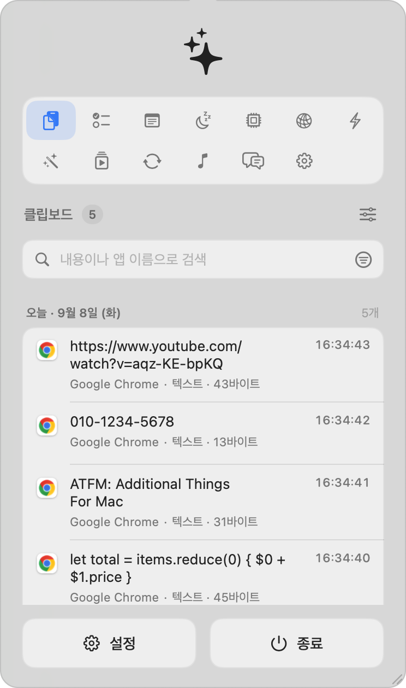<br><b>클립보드</b><br><sub>앱별 · 시:분:초 · 검색</sub></td>
    <td align="center">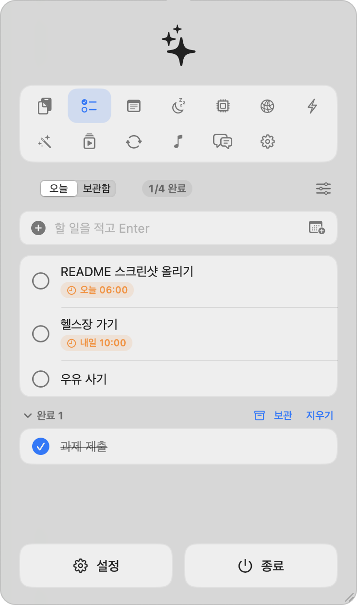<br><b>체크리스트</b><br><sub>마감 배지 · 보관함</sub></td>
    <td align="center">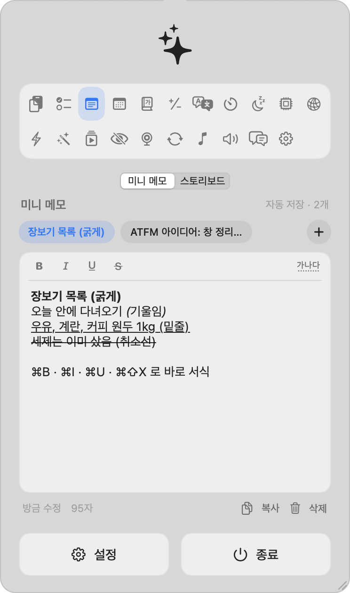<br><b>미니 메모</b><br><sub>자동 저장 스크래치</sub></td>
  </tr>
  <tr>
    <td align="center">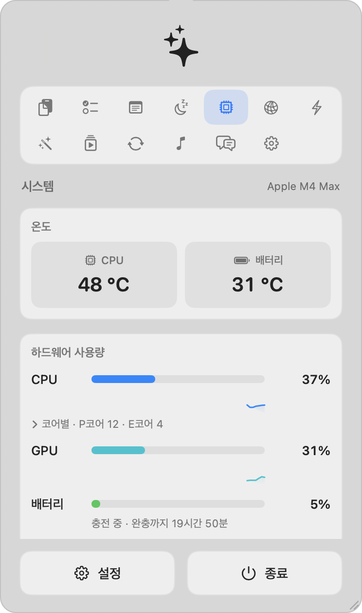<br><b>시스템</b><br><sub>온도 · CPU/GPU · 배터리</sub></td>
    <td align="center">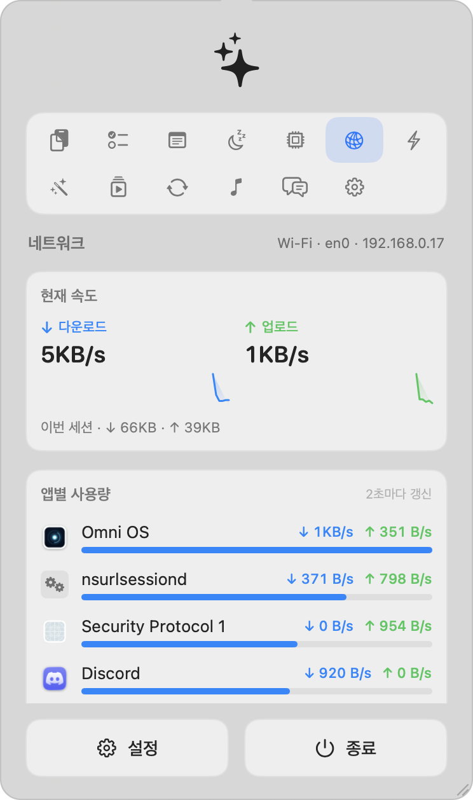<br><b>네트워크</b><br><sub>실시간 속도 · 앱별 사용량</sub></td>
    <td align="center">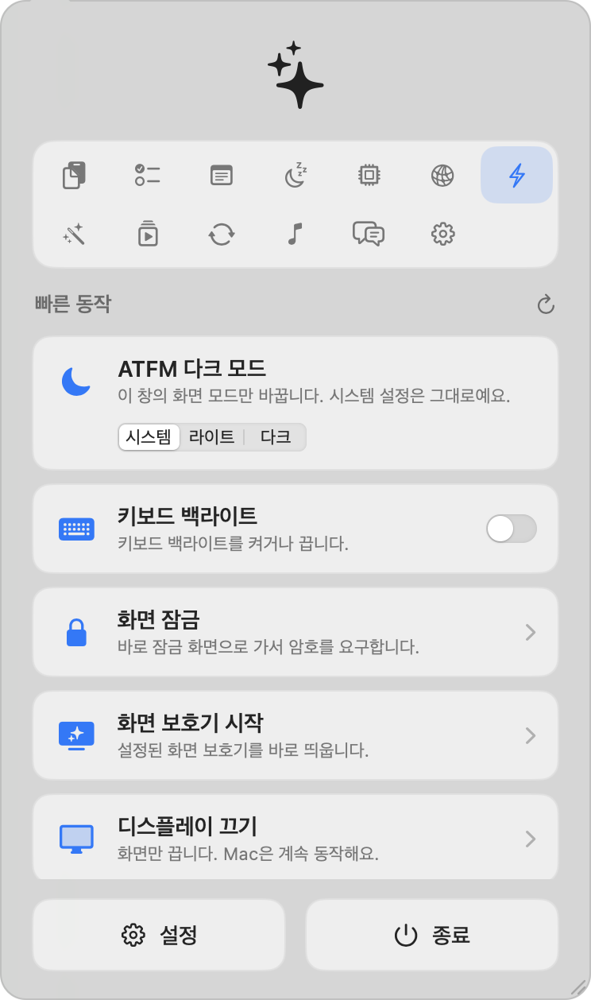<br><b>빠른 동작</b><br><sub>다크 모드 · 백라이트 · 잠금</sub></td>
  </tr>
  <tr>
    <td align="center">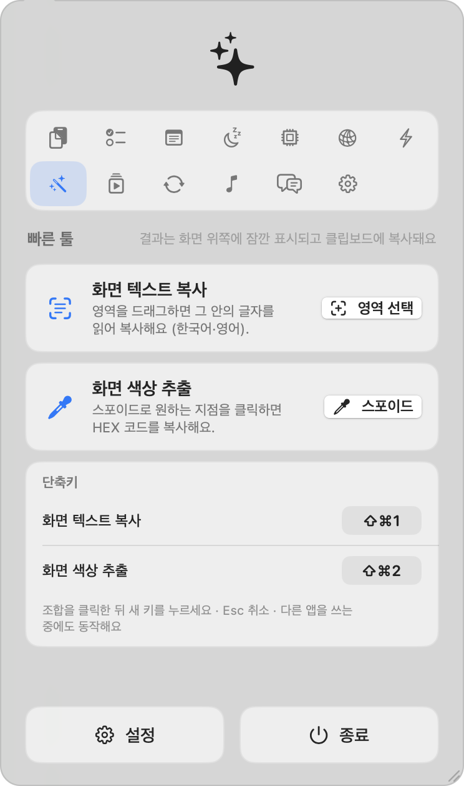<br><b>빠른 툴</b><br><sub>화면 텍스트 복사 · 스포이드 · 단축키</sub></td>
    <td align="center">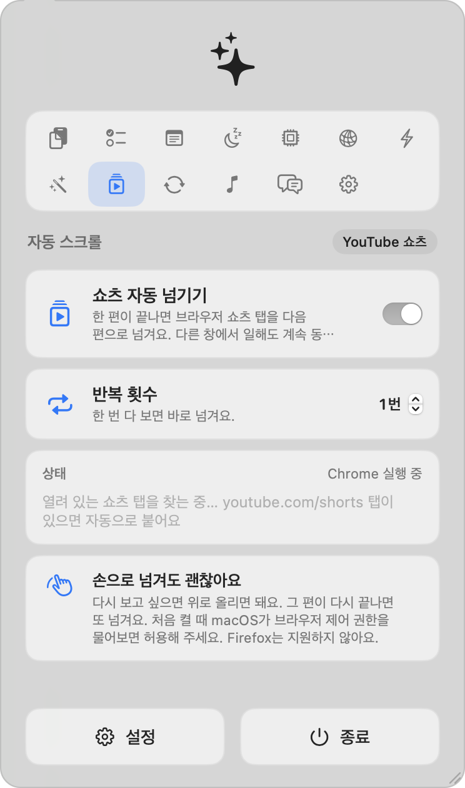<br><b>자동 스크롤</b><br><sub>YouTube 쇼츠 자동 넘기기</sub></td>
    <td align="center">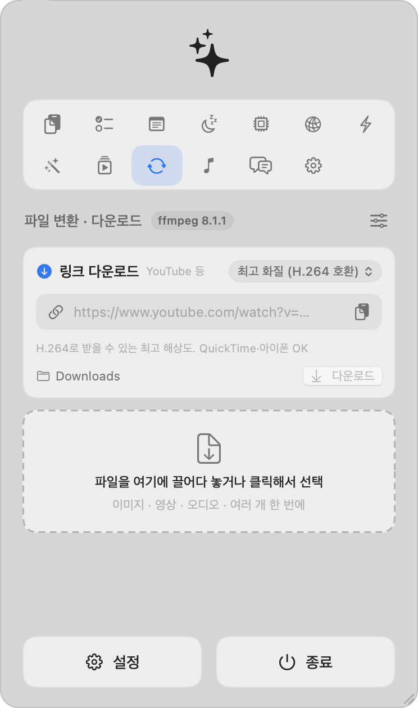<br><b>파일 변환 · 다운로드</b><br><sub>yt-dlp · ffmpeg</sub></td>
  </tr>
  <tr>
    <td align="center">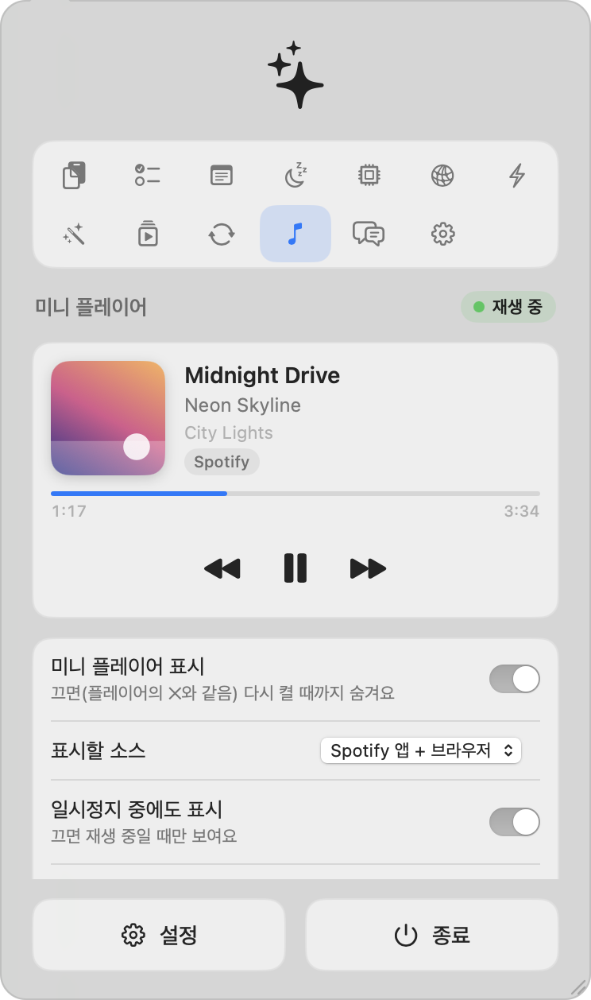<br><b>미니 플레이어</b><br><sub>Now Playing 제어</sub></td>
    <td align="center">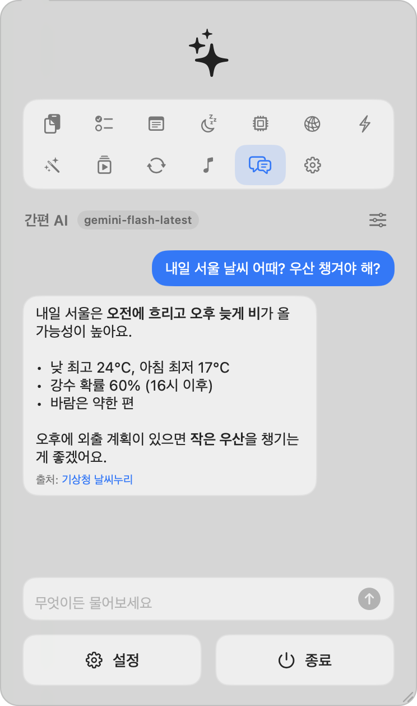<br><b>간편 AI</b><br><sub>Gemini · 웹 검색 출처</sub></td>
    <td align="center">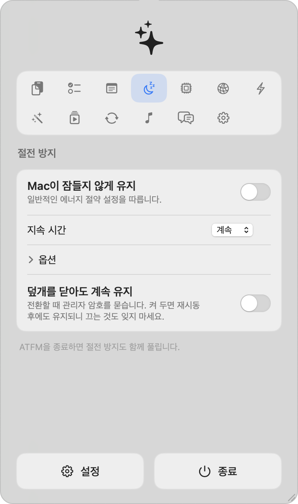<br><b>절전 방지</b><br><sub>지속 시간 · 덮개 닫아도 유지</sub></td>
  </tr>
  <tr>
    <td align="center">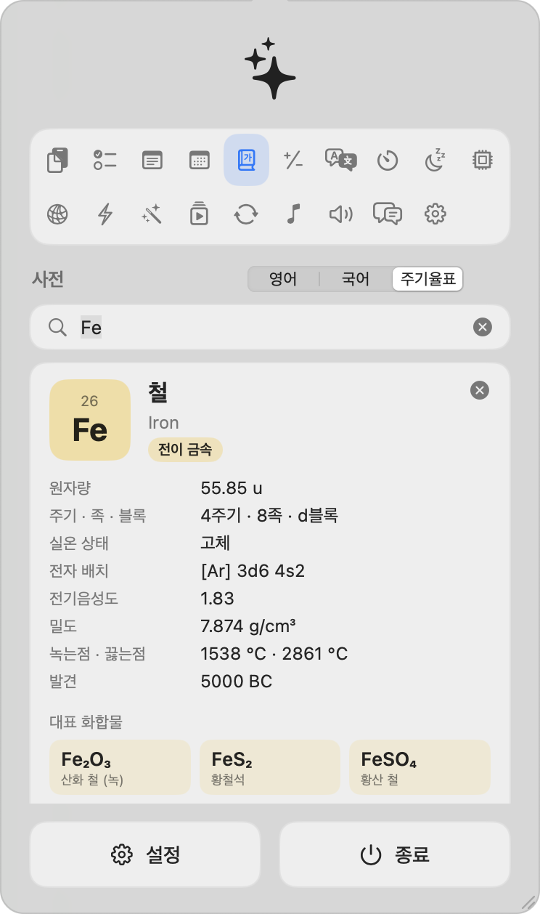<br><b>사전 · 주기율표</b><br><sub>118개 원소 · 한글 이름 · 성질</sub></td>
    <td align="center">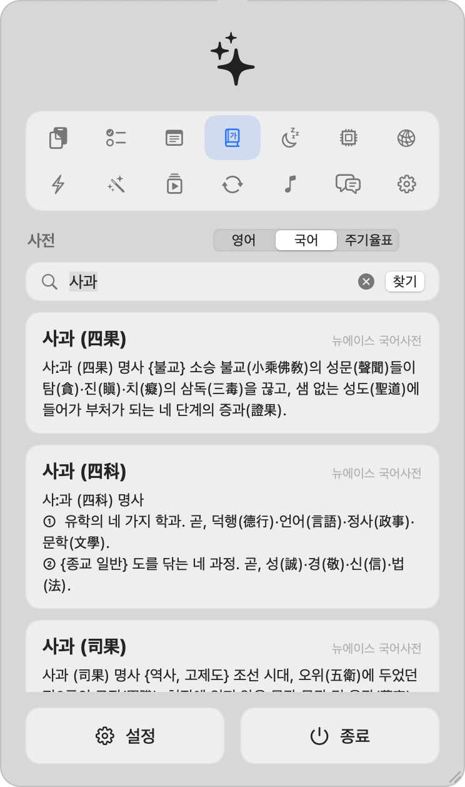<br><b>사전 · 국어/영어</b><br><sub>macOS 내장 뉴에이스 사전 · 동음이의어</sub></td>
    <td></td>
  </tr>
</table>

<p>
  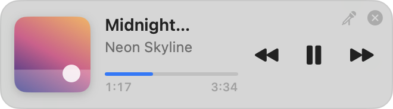&nbsp;&nbsp;
  &nbsp;&nbsp;
  
</p>
<sub>플로팅 미니 플레이어 · 빠른 툴의 상단 팝업(텍스트 복사 / 색상 추출) · 설정 탭은 <a href="docs/screenshots/settings.png">여기</a></sub>

## 지금 되는 것

- 메뉴 막대에 조용히 상주하는 아이콘 (Dock 아이콘 없음)
- 아이콘을 누르면 아래로 부드럽게 내려오는 **말풍선 팝업**
  - 다른 앱으로 전환하거나 바깥을 클릭해도 닫히지 않고, 아이콘을 다시 누를 때까지 계속 떠 있습니다 (Esc로도 닫힘)
  - 왼쪽·오른쪽·아래 가장자리와 오른쪽 아래 모서리 그립을 드래그해 크기 조절 (최소 300×420, 최대 가로 640 · 세로 화면 끝까지).
    화살표는 항상 메뉴 막대 아이콘을 가리키고, 크기는 기억됩니다. 그립 더블클릭 또는 설정 → "기본값으로"
- 클립보드 기록
  - ⌘C 로 복사한 텍스트 · 이미지 · 파일(Finder)을 모두 저장
  - **어떤 앱에서** 복사했는지 앱 아이콘과 이름으로 표시
  - 날짜별로 묶고, 항목마다 **시:분:초** 표시
  - 내용 / 앱 이름으로 검색, 앱 · 종류(텍스트/이미지/파일)로 필터
  - 항목 클릭 → 다시 클립보드로 복사
  - 삭제: 하나씩(hover 후 ✕), 선택해서 여러 개, 전체 삭제
  - 암호 관리자에서 복사한 비밀 값(`org.nspasteboard.ConcealedType`)은 기록하지 않음
- 설정: 최대 보관 개수, 중복 항목 위로 올리기, 이미지/파일 저장 여부, 로그인 시 자동 실행,
  **테마**(ATFM 기본 · JARVIS · 미드나이트 · 세이지 — 말풍선/미니 플레이어의 강조색·틴트·외관)
- **체크리스트** 탭: 적고 Enter로 추가, 체크로 완료, 더블클릭 수정, 호버 ✕ 삭제, 완료 항목 접기/한 번에 지우기.
  `~/Library/Application Support/ATFM/checklist.json` 에 자동 저장
  - **마감**: 입력창의 달력 버튼(또는 항목 우클릭)으로 날짜+시간 지정. "오늘 18:00" 같은 배지가 붙고 지난 건 빨강·24시간 안은 주황.
    메뉴에서 "마감 임박 순 정렬"
  - **보관함**: 날짜가 바뀌면 전날 목록(완료·미완료 모두)이 그 날짜 아래로 자동 보관(앱이 꺼져 있었으면 다음 실행 때).
    완료한 항목은 "보관" 버튼으로 오늘 날짜에 바로 보관. 보관함에서 날짜별 접기, 되돌리기(오늘 목록으로), 항목/날짜/전체 삭제.
    메뉴의 "미완료는 다음 날로 넘기기"를 켜면 미완료 항목은 보관하지 않고 남김
- **절전 방지** 탭: 스위치 하나로 자동 잠자기 방지(계속 · 30분 ~ 8시간), 화면 켜 둠 옵션,
  덮개를 닫아도 유지(`pmset disablesleep`, 관리자 암호 필요). ATFM 종료 시 자동 해제
- **시스템** 탭
  - CPU(코어별 포함) · GPU · 배터리 사용량과 최근 1분 추이
  - CPU / 배터리 온도 (Apple Silicon 내부 센서, 권한 불필요)
  - **앱별 사용량**: 헬퍼 프로세스를 부모 앱으로 묶어서(Activity Monitor 방식) CPU · 메모리 순으로 표시
  - 메모리 압력, 앱/사용 중/압축/캐시/스왑 분해, 가동 시간
- **네트워크** 탭
  - 현재 다운로드/업로드 속도와 추이, 인터페이스 · IP, 세션 누적량
  - **앱별 사용량**: `nettop` 을 스트리밍해서 2초마다 앱별 ↓↑ 속도 표시
  - 속도 측정: Cloudflare 서버로 다운로드/업로드 Mbps 와 지연 시간 측정 (버튼을 눌렀을 때만)
- **빠른 동작** 탭
  - **리소스 잡아먹는 앱 정리**: "검사"를 누르면 3초 동안 실행 중인 Dock 앱의 CPU · 메모리 · 네트워크와 화면 위 창 개수를 재서,
    백그라운드에서 CPU/네트워크를 태우거나 창 없이 메모리를 쥐고 있는 앱을 체크된 상태로 제안. 지금 사용 중인 앱·재생 중인 앱은
    제외, 방패 버튼으로 앱을 영구 보호. "선택한 N개 종료"는 기본적으로 정상 종료(저장 확인 가능)이고 "강제 종료"를 켜면 즉시 kill
  - ATFM 다크 모드: 시스템 설정은 그대로 두고 이 창만 라이트/다크/시스템으로 전환
  - 키보드 백라이트 켜기/끄기 (CoreBrightness, 권한 불필요)
  - 화면 잠금(⌃⌘Q 와 동일하게 암호 화면으로), 화면 보호기 시작, 디스플레이 끄기
  - 휴지통 비우기(확인 후, Finder 자동화 권한 1회 요청), 모든 외장 디스크 추출
  - 숨겨진 파일 보기 · 데스크탑 아이콘 가리기 (Finder 재시작)
- **빠른 툴** 탭
  - **화면 텍스트 복사**: 스크린샷처럼 영역을 드래그하면 그 안의 글자를 Vision OCR(한국어·영어)로 읽어 클립보드에 복사하고,
    화면 위쪽 가장자리에 1~2초 팝업으로 보여줍니다. 시스템 설정의 **화면 기록** 권한이 필요해요 (허용 후 ATFM 재실행)
  - **화면 색상 추출**: macOS 스포이드(`NSColorSampler`)로 원하는 지점을 클릭하면 `#RRGGBB` HEX를 팝업으로 띄우고 복사합니다
  - 최근 결과 목록에서 클릭 한 번으로 다시 복사
  - **단축키**: 기본 ⌘⇧1(텍스트 복사) · ⌘⇧2(색상 추출). 다른 앱을 쓰는 중에도 동작(Carbon `RegisterEventHotKey`, 손쉬운 사용 권한 불필요).
    탭의 단축키 카드에서 조합을 클릭한 뒤 새 키를 눌러 바꾸고, ↺ 로 하나씩 또는 "모두 기본값으로" 되돌릴 수 있음
- **미니 메모** 탭: 잠깐 적어두는 스크래치 메모장. 여러 개를 칩으로 오가며 쓰고, 입력 즉시 자동 저장(`notes.json`),
  전체 복사 · 삭제(확인 한 번). 첫 줄이 메모 제목이 됩니다
- **사전** 탭: 영어 · 국어 · 주기율표
  - **영어**: macOS에 내장된 뉴에이스 영한·한영사전(오프라인)으로 영어 단어 → 우리말 뜻·발음·예문, 한국어 → 영어 표현.
    Oxford 영영사전이 켜져 있으면 영영 풀이도 함께, 없으면 dictionaryapi.dev(무료)로 영영 풀이를 온라인으로 가져옴
  - **국어**: 뉴에이스 국어사전(오프라인)으로 동음이의어를 전부 표시(사과 → 四果·四科·沙果…). 없는 단어는 비슷한 표제어 제안
  - 사전이 내려받아져 있지 않으면 안내 카드 + "사전 앱 열기". "사전 앱에서 보기"로 `dict://` 링크 열기. 클립보드의 짧은 단어를 자동 입력
  - **주기율표**: 118개 원소를 한 화면에(족별 색, 란타넘·악티늄족 포함). 이름(한글·옛 이름·영어)·기호·번호로 검색, 원소를 누르면
    원자량 · 주기/족/블록 · 실온 상태 · 전자 배치 · 전기음성도 · 밀도 · 녹는점/끓는점 · 발견 + 위키백과 링크.
    데이터: [Bowserinator/Periodic-Table-JSON](https://github.com/Bowserinator/Periodic-Table-JSON) (CC BY-SA 3.0) + 대한화학회 표기 한글 이름
- **자동 스크롤** 탭 (YouTube 쇼츠)
  - 브라우저의 쇼츠 탭을 지켜보다가 한 편이 끝나면 다음 편으로 자동으로 넘깁니다. 다른 창에서 작업 중이어도 계속 동작
  - **반복 횟수**: 1이면 한 번 보고 넘기고, N이면 같은 쇼츠를 N번 본 뒤 넘김. 손으로 위로 올려 다시 봐도 상관없이, 그 편이 끝나면 또 넘김
  - 동작 원리: Apple 이벤트로 브라우저 탭에 작은 스크립트를 주입해 `<video>` 재생 위치를 보고 "다음 동영상" 버튼을 누름
    (버튼 → 컨테이너 스크롤 → 키 입력 순 폴백). 스크립트는 ATFM이 15초 안에 다시 호출하지 않으면 스스로 멈춤
  - 지원: Chrome · Brave · Edge · Vivaldi · Arc · Safari (Firefox는 Apple 이벤트 JavaScript가 없어 불가).
    처음 켤 때 브라우저의 **보기 › 개발자 › Apple 이벤트에서 JavaScript 허용**을 켜야 하고, macOS 자동화 권한을 한 번 허용해야 함
- **파일 변환 · 다운로드** 탭
  - **링크 다운로드**: YouTube 등 링크를 붙여넣고 화질(최고 · H.264 호환 최고 · 1080p · 720p · MP3만)을 골라 저장.
    Homebrew `yt-dlp` + ffmpeg로 최고 영상·오디오 스트림을 받아 MP4로 합칩니다. 진행률·속도·남은 시간, 중단, 완료 후
    Finder/변환 목록 연계. 클립보드에 링크가 있으면 자동으로 채움
  - 필요한 도구: `brew install yt-dlp deno ffmpeg` (deno는 YouTube JS 챌린지 해결용). YouTube는 기본 클라이언트의
    DASH 주소가 도중에 403을 내는 일이 있어(yt-dlp#12482) 임베디드 플레이어 → 기본 → 모바일 웹 순으로 자동 재시도
  - 파일을 끌어다 놓거나 골라서 한 번에 변환
  - 이미지 → PNG · JPEG · HEIC · AVIF · TIFF · GIF · BMP (품질 슬라이더, 최대 크기 축소, 회전 정보 반영). macOS ImageIO 사용
  - 영상 → MP4/MOV (H.264 · HEVC, 하드웨어 인코딩) · MKV · WebM(VP9) · 움직이는 GIF, 해상도/화질 선택, 영상에서 오디오만 추출
  - 오디오 → MP3 · M4A(AAC) · WAV · FLAC · AIFF · OGG(Opus), 비트레이트 선택
  - 영상·오디오는 Homebrew `ffmpeg`(`/opt/homebrew/bin` 또는 `/usr/local/bin`)를 쓰고, 없으면 AVFoundation으로 MP4/MOV/M4A만 지원
  - 저장 위치: 원본 폴더(같은 확장자면 `-변환` 붙임) · 다운로드 · 지정 폴더, 진행률 · 중단 · Finder에서 보기
- **미니 플레이어** 탭: Spotify(앱·웹 플레이어)나 다른 앱이 노래를 재생하면 화면 구석에 작은 플레이어가 뜹니다
  - 앨범아트 · 제목 · 아티스트 · 진행 바 · 이전/재생·일시정지/다음, 항상 위, 모든 Space에서 표시, 드래그로 이동
  - ✕를 누르면 ATFM에서 다시 켤 때까지 숨김. 표시할 소스(Spotify 앱만 / + 브라우저 / 모든 앱), 일시정지 표시, 위치 설정
  - 🎤 버튼으로 아래에 **가사** 박스 펼치기: LRCLIB(무료, 키 불필요)에서 찾아 타임라인 싱크가 있으면 현재 줄을 강조하며
    자동 스크롤(줄 클릭 → 그 위치로 이동), 없으면 일반 가사. 결과는 `Application Support/ATFM/lyrics/`에 캐시
  - 싱크 보정: −/+ 버튼으로 0.5초 단위 누적 조정, 값을 누르면 0으로. 곡별로 기억
  - 가사 고르기: 여러 검색(정확 일치 · 제목+아티스트 · 자유 검색 · 제목만 · 정리한 제목)으로 후보를 모아
    싱크 · 길이 일치 · **한글 포함**(로마자 버전 뒤로) · 이름 일치 순으로 자동 선택. ⋯ 메뉴에서 다른 후보 선택,
    다시 검색, 직접 입력(LRC 형식이면 싱크), LRC 파일 가져오기. 선택·입력한 가사는 곡별로 저장
  - macOS의 Now Playing(MediaRemote)은 일반 앱에 정보를 주지 않아서, Apple 서명 `perl`이 작은 브리지
    (`ATFMMediaRemote.dylib` + `mediaremote.pl`)를 로드해 JSON으로 중계합니다. 권한 요청 없음
- **간편 AI** 탭: Gemini 미니 채팅. API 키를 한 번 넣으면 스트리밍으로 답하고, 모델 목록 불러오기/선택
  (쓸 수 없는 모델이면 계정에서 쓸 수 있는 flash 모델로 자동 교체), Google 검색 그라운딩 토글(기본 켜짐,
  날씨·뉴스 같은 실시간 질문에 출처와 함께 답변), 답변 복사, 대화 기록은 최근 20개까지 보관.
  키와 대화는 이 Mac에만 저장(`gemini-chats.json`)

데이터는 `~/Library/Application Support/ATFM/clipboard.sqlite` 에 SQLite로 저장됩니다.

## 빌드

Xcode 없이 Command Line Tools만 있으면 됩니다 (macOS 14+, Swift 5.9+).

```bash
./build.sh          # build/ATFM.app 생성
./build.sh --run    # 빌드 후 실행
```

`build.sh` 는 `swiftc` 로 직접 컴파일한 뒤 `.app` 번들을 조립하고 서명합니다. 키체인에 코드 서명 인증서가 있으면
(`ATFM_SIGN_IDENTITY`, 기본값 `Omni Dev Signing`) 그걸로 서명해 화면 기록·자동화 권한이 재빌드 후에도 유지되고, 없으면 ad-hoc 서명합니다.
릴리즈 빌드는 서명 검증을 통과한 사본을 **`~/Applications/ATFM.app`** 에 설치하고(`ATFM_INSTALL_DIR`로 변경 가능) `--run`은 그 사본을 엽니다.
프로젝트 폴더가 iCloud 동기화(데스크탑) 안에 있으면 Finder가 번들에 `com.apple.FinderInfo`를 계속 붙여 서명이 깨지고, 그러면 macOS가
화면 기록 같은 권한을 무시하기 때문입니다. `build/ATFM.app`은 스냅샷 등 개발용으로만 씁니다.
Xcode가 있다면 `Package.swift` 를 열어서 빌드해도 됩니다.
첫 빌드는 SDK 모듈 캐시(`build/ModuleCache`)를 만드느라 몇 분 걸리고, 그 다음부터는 수 초면 끝납니다.

개발용 환경 변수:

| 변수 | 동작 |
|---|---|
| `ATFM_AUTO_SHOW=1` | 실행 직후 말풍선을 바로 엽니다 |
| `ATFM_SNAPSHOT=/path/out.png` | 잠시 뒤 말풍선 창을 PNG로 저장합니다 (화면 기록 권한 불필요) |
| `ATFM_DEBUG_DICT="english\|korean\|periodic|검색어"` | 사전 탭을 해당 섹션·검색어로 열어 둡니다 (스냅샷용); `ATFM_PROBE_DICT=단어 ATFM --probe`는 사전 조회를 출력 |
| `ATFM_DEBUG_CLEANUP_SCAN=1` | 빠른 동작 탭의 앱 정리 검사를 실행 직후 자동으로 돌립니다 (스냅샷용) |
| `ATFM_DEBUG_DATA_DIR=<dir>` | 클립보드 DB · 체크리스트 · 메모 · AI 대화를 모두 지정 폴더에서 읽고 씁니다 (`Scripts/screenshots.sh`가 사용) |
| `ATFM_DEBUG_NOWPLAYING_SAMPLE=1` | 실제 재생 정보 대신 가짜 트랙을 미니 플레이어에 띄웁니다 (스크린샷용) |
| `ATFM_DEBUG_NOTES_DIR=<dir>` | 미니 메모를 실제 데이터 대신 지정 폴더의 notes.json으로 읽고 씁니다 (스냅샷용) |
| `ATFM_PROBE_AUTOSCROLL=js\|script\|safari` | 쇼츠 에이전트 JS / 생성된 AppleScript를 출력합니다 (osacompile로 문법 검사) |
| `ATFM_DEBUG_TOOLS=ocr-bubble\|hud-text\|hud-color\|overlay` + `ATFM_SNAPSHOT_HUD=/path.png` | 빠른 툴의 OCR·HUD·오버레이를 마우스 없이 실행하고 캡처합니다 |
| `ATFM_SNAPSHOT_DELAY=6` | 스냅샷까지 기다리는 초 (기본 2) |
| `ATFM_TAB=system` | 시작 탭 (`clipboard` · `checklist` · `awake` · `system` · `network` · `actions` · `convert` · `player` · `ai` · `settings`) |
| `ATFM_SNAPSHOT_MINI=/path.png` | 미니 플레이어 창을 PNG로 저장 |
| `ATFM_DEBUG_RESIZE=left:-40,bottom:120` | 표시 직후 말풍선 크기 조절을 적용 (저장되지 않게 하려면 `ATFM_PANEL_HEIGHT`와 함께) |
| `ATFM_PANEL_HEIGHT=1040` | 말풍선 높이 (기본 640) |

`Scripts/dev-run.sh system` 처럼 탭 이름을 주면 위 조합으로 실행하고 `build/snap-<tab>.png` 를 남깁니다.
`ATFM --probe` 는 센서 · GPU · 메모리 · 앱별 사용량 샘플을 터미널에 출력합니다.

```bash
Scripts/dev-run.sh network
```

## 구조

```
Sources/ATFM
├── App/         진입점, 메뉴 막대 아이템, 말풍선 패널(NSPanel + NSVisualEffectView)
├── Clipboard/   모델, SQLite 저장소, 페이스트보드 감시, 뷰모델
├── Checklist/   체크리스트 저장소 (JSON)
├── Awake/       절전 방지 (IOPMAssertion, pmset disablesleep)
├── AI/          Gemini REST 클라이언트(SSE 스트리밍) + 대화 저장
├── Convert/     파일 변환 (ImageIO · ffmpeg · AVFoundation 엔진, 변환 큐) + yt-dlp 다운로더
├── NowPlaying/  Now Playing 브리지 클라이언트, 미니 플레이어 패널, LRCLIB 가사
├── System/      CPU·메모리·GPU·배터리·온도 프로브, 프로세스별 샘플러, 시스템 모니터
├── Network/     인터페이스 카운터 + nettop 스트리밍, 속도 측정
├── Actions/     빠른 동작 (앱 정리 AppCleaner, 백라이트, 잠금, Finder 설정, 휴지통, 디스크 추출)
├── Notes/       미니 메모 (QuickNotesStore, notes.json 자동 저장)
├── Dictionary/  사전 (DictionaryServices 래퍼, 온라인 영영, 주기율표 데이터 Resources/elements.json)
├── Tools/       빠른 툴 (영역 선택 오버레이 → Vision OCR, 스포이드 HEX, 상단 HUD, 전역 단축키)
├── AutoScroll/  자동 스크롤 (쇼츠 탭 폴링 osascript + 페이지 에이전트 JS)
├── UI/          SwiftUI 화면 (탭별 화면 전부)
└── Support/     설정 키, 앱 아이콘 캐시
Sources/MediaRemoteBridge/Bridge.swift   perl이 로드하는 MediaRemote 브리지 (dylib로 따로 빌드)
```

## 앞으로

ATFM 은 기능을 계속 추가하는 것을 전제로 만들어졌습니다. 상단 탭바에 아이콘 하나를 더하고
`AppTab` 에 case 를 추가하면 새 기능 화면이 붙습니다.
